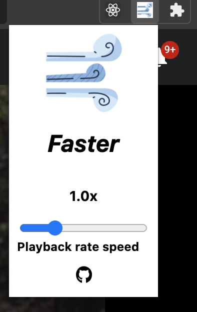

<h1 align="center"><i>Faster</i></h1>

---

### Summary

The main idea of this project is to be a simple chrome extension that helps you change the playback rate of the content you are watching, when the feature is not available or when it doesn't have the option you want.

---

### Usage

Download it from [here](https://chrome.google.com/webstore/search/Faster), once you have downloaded, just pin the extension and by clicking on it, the extension popup will show up and then you can change the video rate from there, if there is a video available.

