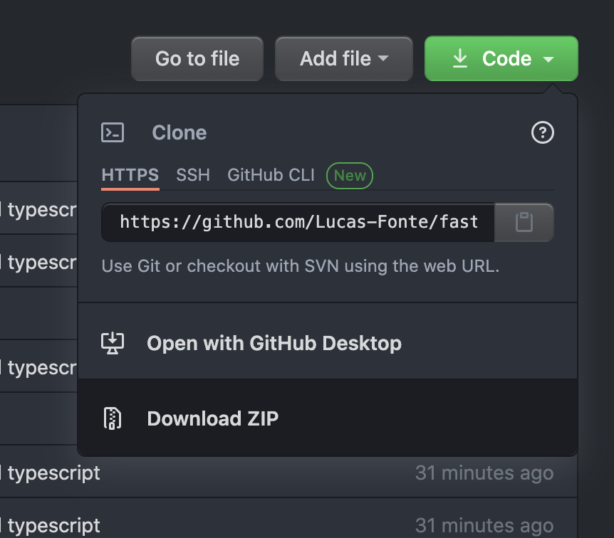
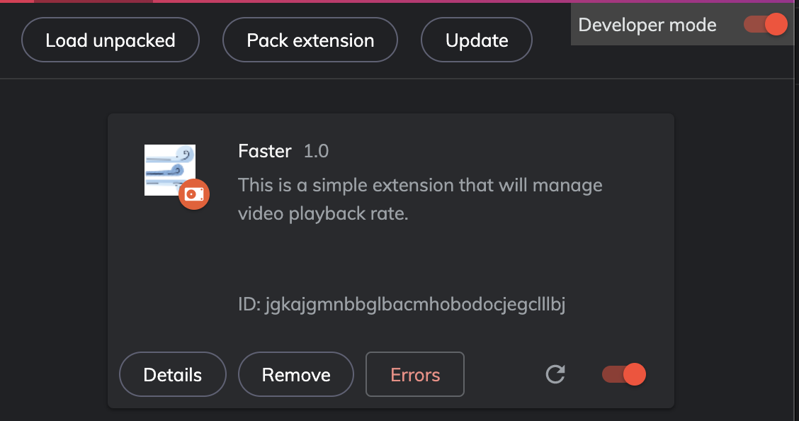
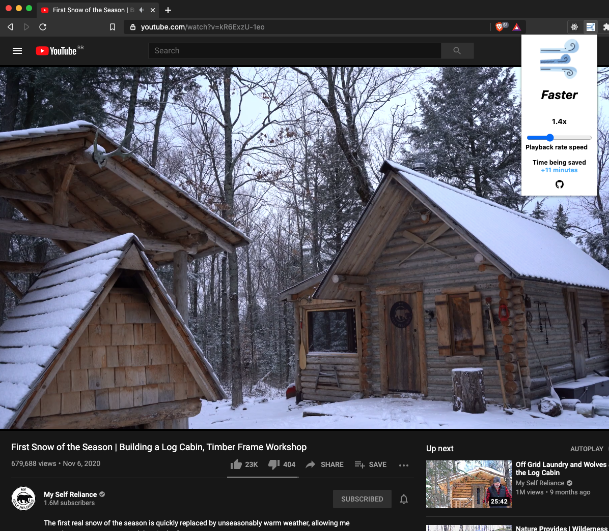

<h1 align="center"><i>Faster</i></h1>

---

## Summary

The main idea of this project is to be a simple chrome extension that helps you change the playback rate of the content you are watching, when the feature is not available or when it doesn't have the option you want.

---

## Installation

- ### Step 1

  Copy the project to your local machine or if you are a git user clone the repository, you can use the button on the right corner.

- ### Step 2

After copying or cloning the project to your computer, go to your chromium based browser extension settings, (something like <a href="chrome://extensions/">chrome://extensions/</a>).
Then you turn on **Development mode**, on the right corner and there should be an option saying **Load unpacked** on your left corner this time, click on it and select the project folder your just copied/cloned, (probably somewhere like `your_username/downloads/faster`).
After that you are pretty much good to go! (;

  

---

## Usage

Once you have downloaded, just pin the extension and by clicking on it, the extension popup will show up and then you can change the video rate from there, if there is a video available.

